# Análise geral do GUEASS para reescrita da ERS

| Campo | Valor |
| --- | --- |
| Data da análise | 2026-10-03 |
| Commit analisado | `fe59959` (`fe599596277805d3f7cb841a368f52effad26d3e`) |
| Branch | `hardening/seguranca` |
| Testes | 774 passed, 4007 assertions, 17,97 s (`php artisan test --compact` com o PHP do Laragon) |
| PHP da suíte | 8.3.30 (cli) ZTS, `C:\laragon\bin\php\php-8.3.30-Win32-vs16-x64\php.exe` |
| PHP em `PATH` | 8.2.12, `C:\xampp\php\php.exe` — não foi o interpretador da suíte |

Este texto descreve somente o que o código, o esquema MySQL em uso, os locks e os comandos executados mostram. Onde o código não define o fato, a célula ou a frase diz **NÃO ENCONTRADO** ou **INCERTO**, com o motivo. Documentos em `docs/` foram tratados como hipótese e só entram quando o código confirma ou quando a divergência é o próprio achado.

Sigla usada na ERS antiga extraída de `storage/app/_ers_unzip/doc/word/document.xml`: GUEASS = Gerador de Prompts Especializado. O código não redefine a sigla; `config/app.php` usa `env('APP_NAME', 'Laravel')` e `.env.example` define `APP_NAME=Gueass`. O valor efetivo de `APP_NAME` no processo em execução **não foi lido** (arquivo `.env` não consultado).

---

> Parte 2 de 2. O início está em `docs/analise-geral-para-ers-parte-1.md` (seções 0 a 7). Mesmo commit do topo.

## 8. ARQUITETURA E CLASSES

Camadas observadas: HTTP (`app/Http`), domínio/aplicação (`app/Services`, `app/Models`), contratos (`app/Contracts`), console (`app/Console`), bootstrap (`app/Providers`, `bootstrap/app.php`), views (`resources/views`), front (`resources/js`, `resources/css`). Não há pasta `app/Actions` nem `app/Repositories`.

| Tipo | Símbolo | Responsabilidade em uma linha |
| --- | --- | --- |
| Controller | `AuthController` | Login, registro, logout e logs desses eventos |
| Controller | `PromptController` | Home, geração, feedback, exclusão, limpeza de histórico, autorização de dono |
| Controller | `ProfileController` | Perfil, senha forçada, avatar, exclusão de conta |
| Controller | `LanguageController` | CRUD de linguagens e bloqueio de delete com vínculo |
| Controller | `FrameworkController` | CRUD de frameworks |
| Controller | `ArchitectureController` | CRUD de arquiteturas |
| Controller | `TemplateController` | CRUD de templates e agrupamento por bloco no index |
| Controller | `AdminDashboardController` | Métricas e corte |
| Controller | `AdminUserController` | Lista usuários e senha temporária |
| Controller | `AdminAuditLogController` | Lista audit_logs filtrável |
| Request | `GeneratePromptRequest` | Limites, aliases, UTF-8, guardrail, chaves de variável |
| Request | `UpdateProfileRequest` | Nome, senha opcional, avatar opcional |
| Request | `UpdateAvatarRequest` | Arquivo de foto e log de SVG |
| Request | `DeleteAccountRequest` | Senha atual e último ADM |
| Request | `StoreTemplateRequest` / `UpdateTemplateRequest` | Campos do template; authorize() retorna true (a autorização é o middleware) |
| Service | `PromptPipelineService` | Fachada de uma linha para o gerador |
| Service | `PromptGeneratorService` | Orquestra guardrail, análise local, seletor, provedor, envelope |
| Service | `PromptBuilderService` | Monta lean ou envelope de cinco seções |
| Service | `PromptOutputPolicy` | Decide prosa e limpa enquadramento |
| Service | `CatalogHintResolver` | Deduz IDs para gravar |
| Service | `PromptMetricsService` | Agregações e corte |
| Service | `AvatarSanitizer` | Reprocessa imagem com GD |
| Service | `InputSanityGuardrail` | Recusa ou classifica lean/full |
| Service | `PromptInjectionDetector` | Categorias de injection |
| Service | `PromptInjectionPatterns` | Regex por categoria |
| Service | `SensitiveDataRedactor` | Marcadores de segredo |
| Service | `UserIntentFrame` | Delimitadores e neutralização |
| Service | `TextNormalizer` | NFKC, homóglifo, leet, invisíveis |
| Service | `IntentAnalyzer` | Sanitiza e normaliza o JSON de intenção |
| Service | `IntentSynthesizer` | Monta briefing `user_input` com provedor null dentro de `variables()` |
| Service | `TemplateSelector` | Pontua templates ativos |
| Service | `TemplateInterpolator` | Placeholders do corpo |
| Service | `PromptComposer` | Composição offline quando o prompt_gerado vem vazio |
| Service | `NullAIProvider` | JSON estruturado sem rede |
| Service | `GeminiAIProvider` | HTTP Gemini fail-closed |
| Service | `SecurityLogger` | Lista fechada de 32 eventos no canal security |
| Service | `AdminAuditor` | Insere audit_logs e replica o evento no security |
| Middleware | `AssignRequestId` | Gera ou aceita X-Request-Id |
| Middleware | `SecurityHeaders` | CSP e demais cabeçalhos |
| Middleware | `EnsurePasswordIsChanged` | Bloqueia quem tem senha temporária |
| Model | `User`, `Prompt`, `Language`, `Framework`, `Architecture`, `Template`, `AuditLog`, `AppSetting` | Persistência e relações da seção 7 |
| Command | `CreateAdminCommand` | `gueass:create-admin` |
| Command | `PrunePromptsCommand` | `gueass:prune-prompts` |
| Provider | `AppServiceProvider` | Gate admin, throttle login-email-ip, logger, composer da view |
| Provider | `AIServiceProvider` | Bind do driver e do seletor sem provedor |
| Exception | `FriendlyHttpRenderer` | Páginas e JSON de erro |
| Exception | `InputUnprocessableException` | Mensagem única do guardrail |
| Exception | `InvalidIntentException` | Vazia, curta ou unclear |
| Exception | `NoCompatibleTemplateException` | Catálogo sem template utilizável |
| Exception | `PromptAssemblyException` | Envelope lean acima de 25 linhas ou núcleo vazio |
| Exception | `AIProviderException` | Falha do provedor |
| Exception | `AvatarRejectedException` | Imagem recusada |
| Exception | `CannotRemoveLastAdminException` | Último ADM |
| Logging | `RedactingProcessor` | Segredos e CRLF no canal security |

Padrões visíveis no código: Form Request, middleware, service provider, strategy via `AIProviderInterface`, value objects readonly (`InputSanityVerdict`, `PromptPipelineResult`, `PromptBuildContext`). Não há repositório nem event sourcing. `audit_logs` é append-only só pelo model.

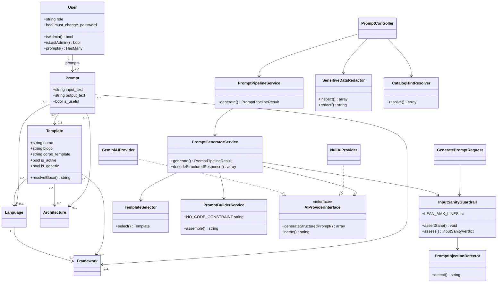

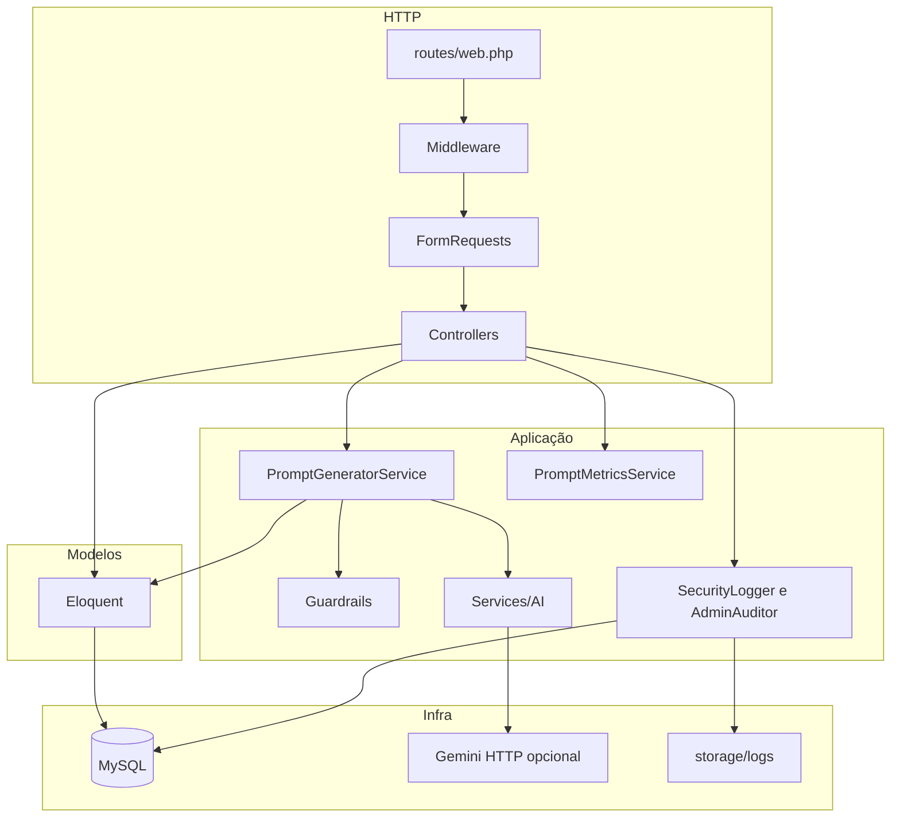

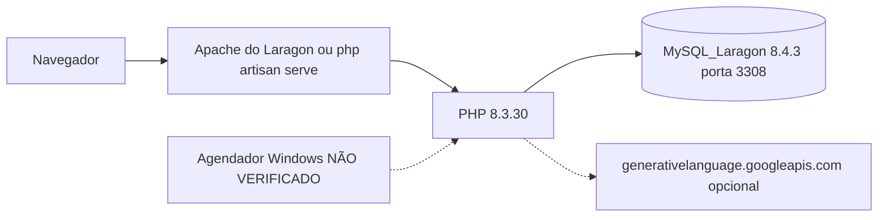

O processo que escuta HTTP neste momento (Apache versus `artisan serve`): **NÃO VERIFICADO**. O PHP com o qual os comandos desta análise rodaram é o 8.3.30 do Laragon. O `PATH` aponta para o PHP 8.2.12 do XAMPP.

---
## 9. DIAGRAMAS DE COMPORTAMENTO

Sintaxe Mermaid e PlantUML: **NÃO VALIDADO**. Não foi executado mermaid-cli nem PlantUML nesta sessão (binários não procurados além da ausência de uso). Os diagramas descrevem o código lido; um renderizador pode ainda rejeitar um detalhe de sintaxe.

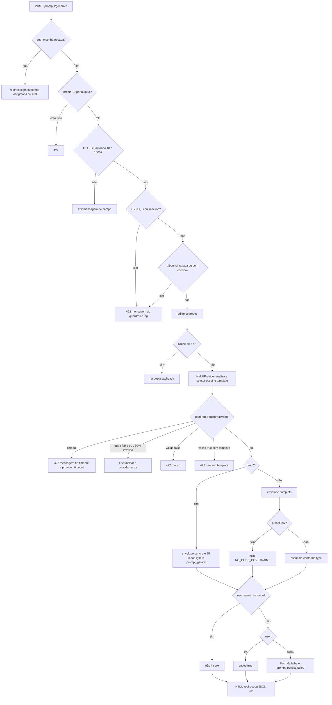

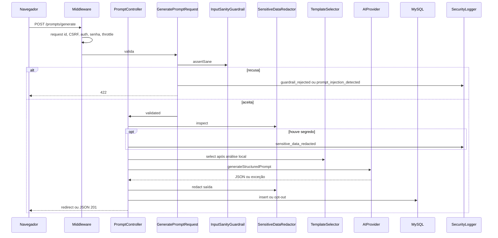

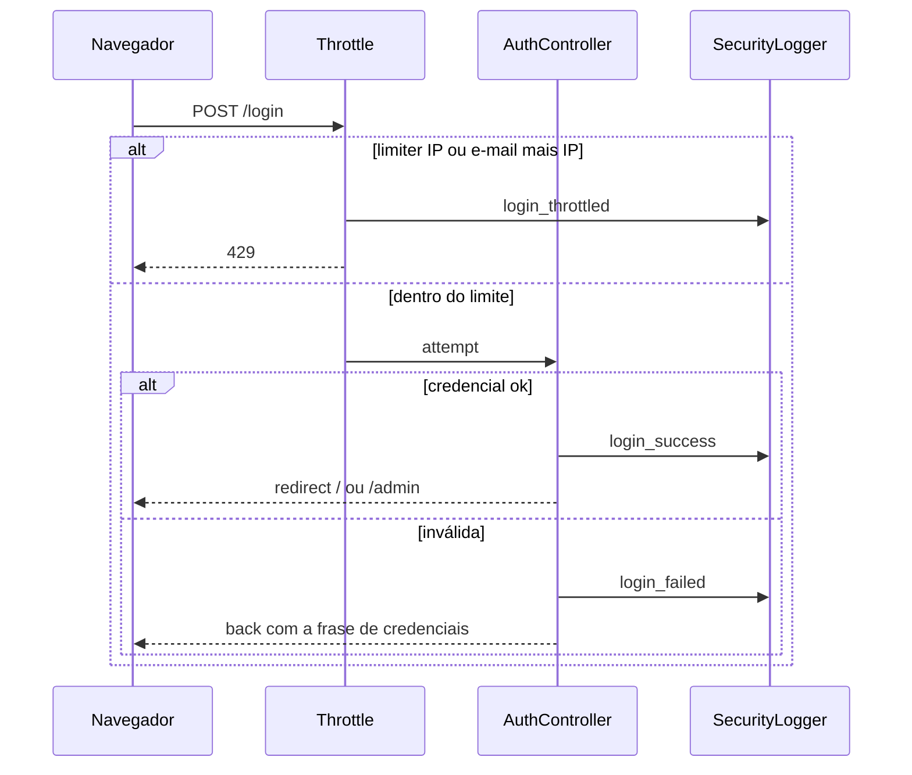

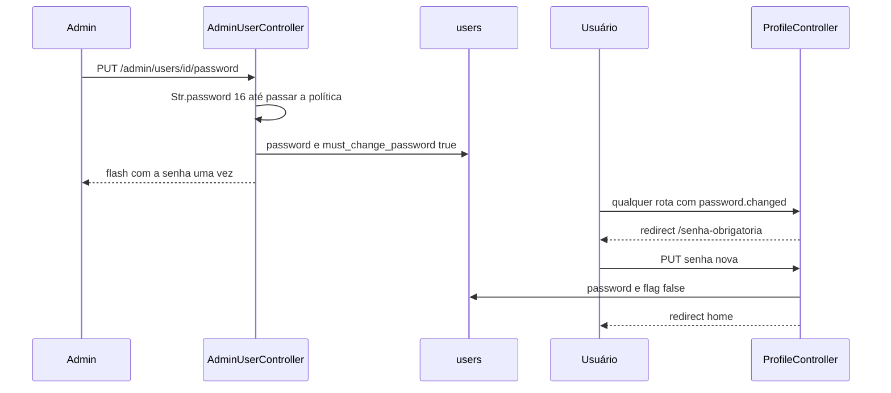

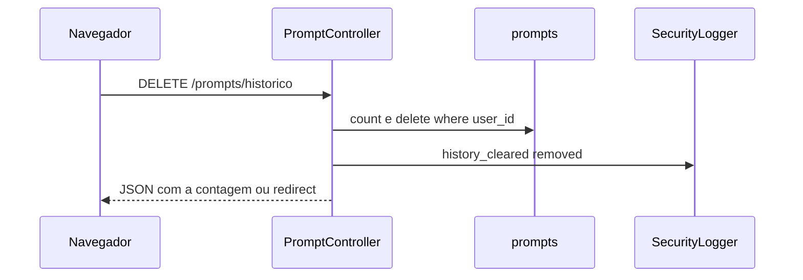

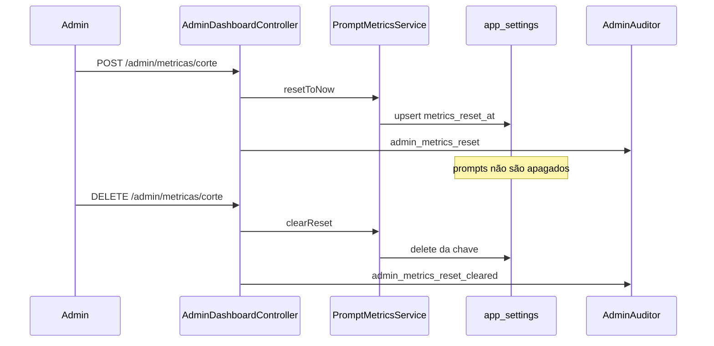

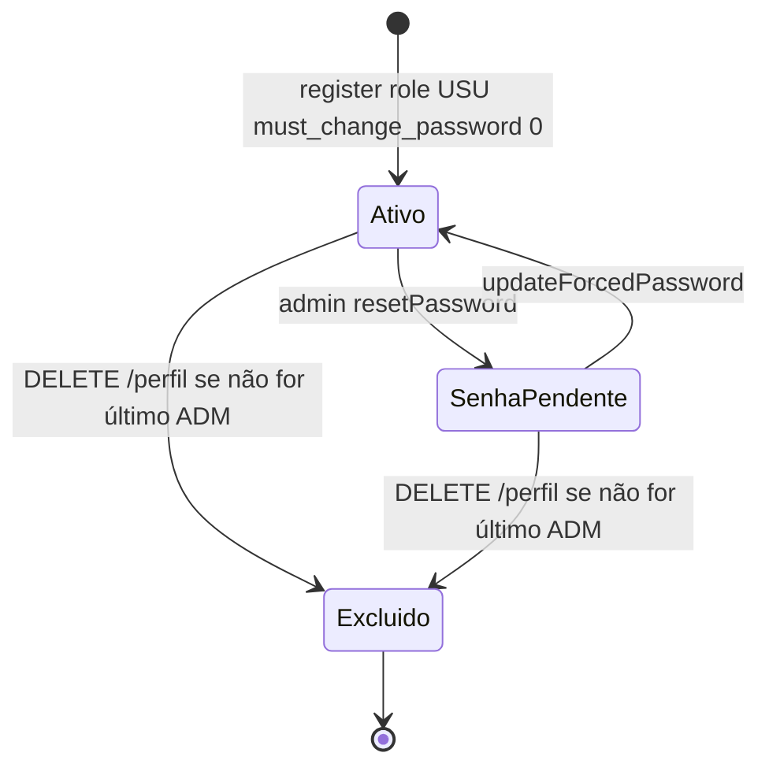

Não há estado “inativo” nem “e-mail verificado” no fluxo. `email_verified_at` não muda de estado na aplicação.

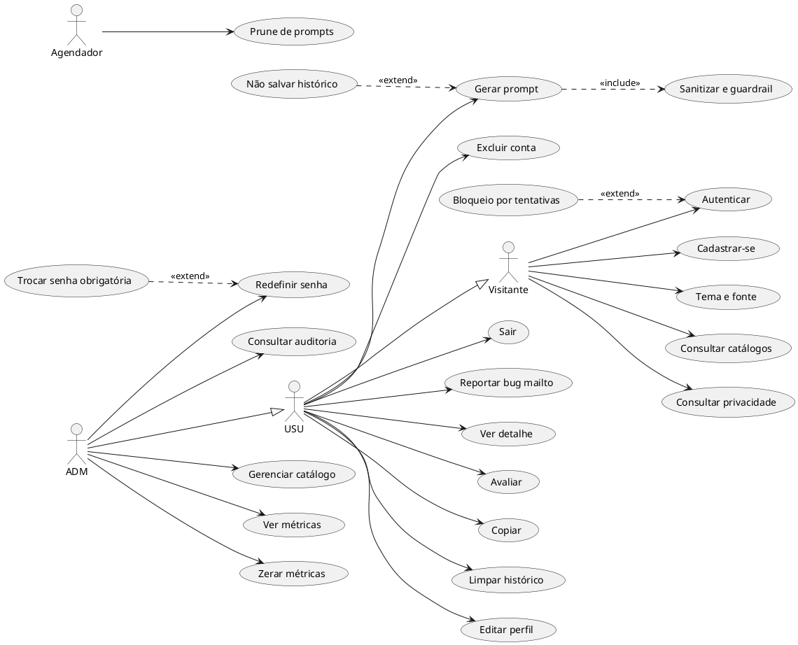

`UC02b` estende o login quando o limiter responde 429. `UC05c` é o checkbox, não um caso separado de rota. `UC04` só ocorre depois que `UC14` ligou a flag (ou outro `forceFill` equivalente; no código HTTP só o reset do admin liga a flag).

---

## 10. INTERFACE E ACESSIBILIDADE

| Rota | Finalidade | Elementos | Vazio / erro |
| --- | --- | --- | --- |
| `GET /login` | Entrar e cadastrar | Abas `role=tabpanel`, modal “Esqueceu a senha” com mailto | Erro de credencial no campo e-mail |
| `GET /` | Gerar | Três selects, textarea intenção minlength 10 maxlength 1000, checkbox de opt-out, botão Gerar, textarea somente leitura, copiar, feedback se houve id | Alerta “Não foi possível gerar o prompt. Revise os campos destacados abaixo.” Placeholder de saída: “O resultado aparece aqui após gerar.” |
| `GET /prompts/{id}` | Detalhe | Texto, copiar saída, feedback | 403/404 conforme seção 3 |
| `GET /perfil` | Perfil | Nome, senha, avatar, excluir | Mensagens de `UpdateProfileRequest` e avatar |
| `GET /senha-obrigatoria` | Troca forçada | Senha e confirmação | Erro de política |
| Index de catálogos | Leitura pública | Tabelas/listas | Vazio depende do banco; texto de empty de cada Blade: NÃO RELIDO um a um |
| Create/edit admin | Formulários | Campos da seção 6 | Back com erro |
| `GET /admin/dashboard` | Métricas | 4 cartões, 3 canvas com `role=img` e `aria-label`, modais de corte | Satisfação “—” e “Nenhuma avaliação registrada ainda.” Stack “—” |
| `GET /admin/users` | Usuários | Lista e modal de senha temporária | — |
| `GET /admin/auditoria` | Auditoria | Filtros e paginação 20 | — |
| `GET /privacidade` | Texto legal | Seis artigos | — |
| `errors/{status}` | Erro | Título, mensagem, request id se a layout o imprime | Ver tabela da seção 3 |

A layout de erro foi lida até a linha 40; a presença do request id no corpo: o renderer passa a variável `requestId`. Se a view o imprime: **INCERTO** (não reli o miolo de `errors/layout.blade.php` depois da linha 40). O header `X-Request-Id` é definido sempre por `AssignRequestId`.

Componentes: modais com `role` implícito via `app-modal`, `aria-labelledby`, botão fechar `aria-label="Fechar"`, foco inicial e ciclo de Tab (`ui.js` `initModals`), Escape fecha modal, menu e sidebar mobile. Confirmações: limpar histórico, zerar métricas, restaurar histórico de métricas, reset de senha (o modal de reset é aberto por `data-modal-open` e `data-reset-action`).

Temas: classe `dark` em `<html>` (`ui.js` `applyTheme`). Alto contraste: classe `high-contrast`. Escala: passos 87,5; 100; 112,5; 125; 137,5 por cento (`FONT_STEPS`). Padrão 100. Botões “Diminuir fonte” e “Aumentar fonte” desabilitam nos extremos.

Atalhos de teclado que existem: Escape (sidebar mobile, modal, menu do usuário); Tab com wrap dentro do modal. **NÃO ENCONTRADO** `accesskey` ou `aria-keyshortcuts`. O que a ERS antiga chama de “atalhos” na sidebar são links de navegação, não teclas.

Skip link: `<a href="#conteudo-principal" class="skip-link">` em `layout.blade.php` e `layouts/guest.blade.php`.

ARIA: `aria-label` no menu, tema, sidebar, copiar, gráficos, feedback (`aria-pressed`, `aria-live`), diálogos de auth. Lista não exaustiva de cada atributo: os arquivos citados na busca de `aria-label`.

Responsividade: JS trata desktop em `min-width: 768px` (`ui.js`). CSS tem `@media (min-width: 640px)`, `768px`, `1024px` e `prefers-reduced-motion: reduce` em `resources/css/app.css`. Não há regra que exija 1024×768 como mínimo suportado; 1024 px é um breakpoint de layout, não um requisito testado em viewport.

Páginas de erro existentes: 400, 401, 403, 404, 405, 419, 422, 429, 500, 503, mais fallback `4xx` e `5xx`.

---

## 11. SEGURANÇA E PRIVACIDADE

| Controle | Ameaça (nome OWASP / LLM, não pontuação de qualidade) | Implementação | Teste |
| --- | --- | --- | --- |
| CSRF | A01/A05 Broken Access Control / Security Misconfiguration no sentido de requisição forjada | `ValidateCsrfToken` no grupo web | `SecurityBatteryTest`, `ErrorPagesTest` (419) |
| Sessão regenerada no login | Fixação de sessão | `AuthController::login` `session()->regenerate()` | `AuthSecurityTest` |
| Sessão invalidada no logout e no delete | Sessão reutilizada | `logout`, `ProfileController::destroy` | `ForcedPasswordChangeTest` |
| Cookie httpOnly, SameSite lax, encrypt | Roubo de cookie via JS | `config/session.php` | `ProductionConfigTest` |
| Gate admin e middleware | Broken Access Control | `can:admin`, `Gate::define` | `AdminUserTest`, `SecurityAuditTest` |
| Dono do prompt | IDOR | `autorizarDono` | `PromptControllerTest` |
| Mass assignment de role | Escalada | `$fillable` sem role | `AuthSecurityTest` |
| Último admin | Perda de administração | `User::booted` | `LastAdminProtectionTest` |
| Throttle | Força bruta e abuso de geração | rotas da seção 6 | `RouteThrottleTest` |
| Senha 8 + letras + números | Credencial fraca | `PasswordRules` | `PasswordPolicyTest` |
| Hash | Vazamento de senha em claro | cast `hashed` | factories e testes de Hash::check |
| uncompromised só em production | Senha conhecida | `PasswordRules` | `ProductionConfigTest` |
| CSP com nonce | XSS via script inline | `SecurityHeaders` | `SecurityHeadersTest` |
| Guardrail XSS/SQLi | Injection clássica na intenção | `hasXssOrSqli` | `InputSanityGuardrailTest`, `SecurityBatteryTest` |
| Detector de injection | LLM01 Prompt Injection | `PromptInjectionDetector` | corpora da seção 12 |
| Delimitadores | Injection por fechamento de bloco | `UserIntentFrame` | `Phase2PrivacyAndInjectionTest` |
| Redator | Vazamento de segredo para histórico e para o provedor | `SensitiveDataRedactor` | `SensitiveDataRedactorTest` (18) |
| Fail-closed Gemini | Resposta não confiável tratada como sucesso | `decodeStructuredResponse` | `GeminiAIProviderTest`, `PromptGeneratorServiceTest` |
| Avatar GD | Polyglot / EXIF / SVG | `AvatarSanitizer` | `AvatarSanitizerTest`, `ProfileAvatarTest` |
| Cabeçalhos | Clickjacking, MIME sniff | `SecurityHeaders` | `SecurityHeadersTest` (3) |
| Log sem segredo | Vazamento em log | `SecurityLogger::withoutSecrets`, `RedactingProcessor` | `Phase3SecurityObservabilityTest` |
| Auditoria imutável no model | Adulteração via Eloquent | `AuditLog::booted` | `Phase3SecurityObservabilityTest` |
| Request id | Correlação sem vazar corpo | `AssignRequestId` | `Phase3SecurityObservabilityTest` |
| Trusted proxies sem `*` | IP forjado | `bootstrap/app.php` | `ProductionConfigTest` |
| HSTS só production e HTTPS | Downgrade | `SecurityHeaders` se `production` e `$request->secure()` | `ProductionConfigTest` |
| Mensagem genérica | Information disclosure | `FriendlyHttpRenderer`, `pareceVazamentoInterno` | `ErrorPagesTest` |

Cabeçalhos definidos em `SecurityHeaders::handle`:

- `Content-Security-Policy`: `default-src 'self'; base-uri 'self'; form-action 'self'; object-src 'none'; frame-ancestors 'none'; script-src 'self' 'nonce-{nonce}'; style-src 'self' 'unsafe-inline'; img-src 'self' data: blob:; font-src 'self' data:; connect-src 'self'; worker-src 'self' blob:`
- Nonce: 16 bytes aleatórios em base64, atributo `cspNonce`, usado nos `<script>` da home e do feedback.
- `style-src` inclui `'unsafe-inline'` de propósito no código (não há nonce de estilo).
- `X-Content-Type-Options: nosniff`
- `X-Frame-Options: DENY`
- `Referrer-Policy: strict-origin-when-cross-origin`
- `Permissions-Policy: camera=(), microphone=(), geolocation=(), payment=(), usb=()`
- `Strict-Transport-Security: max-age=31536000; includeSubDomains` só se production e request secure
- `Cache-Control: no-store, private` se há usuário autenticado

**Canal `security`.** Stack de `security-daily` (JSON, `RotatingFileHandler`, `maxFiles` = `SECURITY_LOG_DAYS` default 30, processadores `RedactingProcessor` e `PsrLogMessageProcessor`) e, se `SECURITY_LOG_STDERR`, também stderr. Arquivo: `storage/logs/security.log`.

Eventos (lista fechada; nome fora dela lança `InvalidArgumentException` e o `log()` captura `Throwable` só em volta do `logger->info`, não em volta dessa checagem — evento desconhecido **propaga**). Cada registro leva `event`, `request_id`, `user_id`, `ip`, `route` (path), `method`, `user_agent` (máx. 180), `timestamp` UTC ISO-8601, `context`.

| Evento | Campos típicos de context além do envelope |
| --- | --- |
| login_success / login_failed | `email` mascarado (`inicial***@domínio`) |
| login_throttled | `status` 429 |
| register | `email` mascarado, `user_id` |
| logout | vazio |
| password_changed / forced_password_change | vazio |
| admin_password_reset | target_type, target_id, user_id (via auditor) |
| authorization_denied | `status`+`action` no dono do prompt, ou `ability` no Gate::after |
| guardrail_rejected | `category`, `length` |
| prompt_injection_detected | `category`, `length` |
| sensitive_data_redacted | `types`, `counts` |
| provider_error / provider_timeout | `provider` |
| prompt_persist_failed | `type` (classe) |
| account_deleted | `user_id`, `email` mascarado |
| history_cleared | `removed` |
| avatar_rejected | `reason` content ou svg |
| admin_metrics_reset | `metrics_reset_at` no metadata da auditoria; o log de security recebe o metadata passado ao `record` |
| admin_metrics_reset_cleared | sem metadata extra |
| admin_language_created/updated, framework, architecture, template created/updated | `nome` no metadata |
| admin_*_deleted | `target_id` |

O que o código remove antes de gravar (`withoutSecrets`): chaves `password`, `token`, `authorization`, `api_key`, `secret`, `cookie`, `intencao`, `prompt`, `output_text`, `input_text`. `RedactingProcessor` ainda troca por `[REDACTED]` chaves sensíveis (inclui `gemini_api_key`, `app_key`, qualquer chave com “password”), mascara e-mails no texto, troca `AKIA…` e troca CR/LF por espaço. Não há garantia no código de que todo segredo possível fora desses padrões seja removido.

**audit_logs.** Só as ações da seção 3 UC17. Metadata passa por `withoutSecrets`. IP do request. Sem texto de prompt.

**Política (`privacy.blade.php`), texto substantivo.**

- Título: Política de Privacidade.
- “O que é o GUEASS”: “O GUEASS é um gerador de prompts de software feito como projeto acadêmico de Trabalho de Conclusão de Curso. Não é um produto comercial.”
- “O que guardamos”: nome, e-mail e senha (hash); foto se enviada; prompts já com segredos trocados por marcadores; registros técnicos de quem fez o quê, quando e de qual IP, sem texto da senha e sem conteúdo da intenção.
- “Para que usamos”: entrar, gerar, ver o próprio histórico, administrador manter catálogo e segurança. “Não vendemos nem compartilhamos esses dados.”
- “Por quanto tempo”: apagados após `PROMPT_RETENTION_DAYS` dias; menção ao checkbox de não salvar.
- “O texto digitado e a IA externa”: só sai do sistema se o administrador ativar o provedor externo; por padrão a geração é local.
- “Como excluir”: “Excluir minha conta” remove cadastro, foto e histórico. Contato `suportegueass@gmail.com`.

Isso é o que a página afirma. O prune só roda se o agendador existir (NÃO VERIFICADO no Windows).

**Bateria.** `docs/testes-de-seguranca.md` é hipótese. O que o código de teste confirma nesta data: a suíte inteira passou (774). Arquivos de segurança: `SecurityBatteryTest` (16), `SecurityHeadersTest` (3), `SecurityAuditTest` (9), `AuthSecurityTest` (5), `RouteThrottleTest` (15), `Phase2PrivacyAndInjectionTest` (9), `Phase3SecurityObservabilityTest` (23), `PasswordPolicyTest` (5), `LastAdminProtectionTest` (5). O conteúdo linha a linha de `docs/testes-de-seguranca.md` não foi reconciliado item a item com cada assert; a evidência usada aqui é o código e a suíte verde. Correções históricas descritas só nesse markdown, sem teste correspondente lido: **NÃO VERIFICADAS** uma a uma.

**ReDoS.** `tests/Unit/Services/Guardrails/RegexReDoSTest.php`: cada regex de injection, do redator e três padrões auxiliares, em payloads de até 1000 caracteres, deve terminar com `preg_match` válido e abaixo de 200 ms. `TextNormalizer::forInjection` em `str_repeat('I g n o r e ', 80)` deve ficar abaixo de 200 ms. A suíte passou, logo esses limites foram satisfeitos nesta execução. Não há número de milissegundos publicado além do teto do teste.

**Corpora** (assert da suíte que passou; taxas finais no código atual):

| Corpus | Ataques | Legítimos | Assert |
| --- | --- | --- | --- |
| `PromptInjectionCorpusTest` | (dataset; 94 testes no arquivo, inclui casos além do relatório) | — | arquivo com 94 testes passou |
| Independente | 40 | 40 | 40 bloqueados e 40 aceitos; listas de falha vazias (`PromptInjectionIndependentCorpusTest`) |
| Cego | 30 | 30 | nenhum ataque passou; nenhum legítimo bloqueado |
| Estrutural | 15 | 15 | idem; o teste chama a medição de “taxas brutas” e em seguida exige listas vazias |

Ressalva: os corpora estão no mesmo repositório do detector. A taxa 40/40, 30/30 e 15/15 é a taxa **depois** de o detector e os casos conviverem no código. Não é uma medição cega feita por um terceiro fora do commit. O teste estrutural grava JSON em `sys_get_temp_dir()`; esse arquivo não foi aberto nesta análise. A taxa “bruta” anterior a ajustes, se existiu só em `docs/`, não foi reexecutada contra um detector antigo. **NÃO ENCONTRADO** no código um número histórico de falso positivo anterior ao assert atual.

Limitações: o guardrail é lista de marcadores e regex, não um classificador medido em corpus externo. `style-src 'unsafe-inline'` permanece. Gemini, se ligado, recebe o texto já redigido, mas o redator só cobre os tipos da tabela. Não há 2FA, não há verificação de e-mail, não há CAPTCHA.

---

## 12. TESTES E QUALIDADE

Comando: PHP 8.3.30 `artisan test --compact`. Resultado: **774 passed (4007 assertions), Duration 17,97 s**, exit 0. Organização: suítes Unit e Feature em `phpunit.xml`. Banco de teste: sqlite memória. `AI_PROVIDER=null`.

Contagem por arquivo (lista do Pest, soma 774):

| Arquivo | N |
| --- | --- |
| Feature\AIProviderBindingTest | 4 |
| Feature\AdminDashboardTest | 10 |
| Feature\AdminUserTest | 6 |
| Feature\AuthSecurityTest | 5 |
| Feature\CatalogPopulationTest | 11 |
| Feature\CatalogReferentialIntegrityTest | 4 |
| Feature\CreateAdminCommandTest | 3 |
| Feature\DatabaseSeederSecurityTest | 2 |
| Feature\ErrorPagesTest | 26 |
| Feature\ForcedPasswordChangeTest | 3 |
| Feature\GeminiIntegrationTest | 7 |
| Feature\HistoryClearTest | 6 |
| Feature\HomeRouteTest | 3 |
| Feature\InputEdgeCasesTest | 33 |
| Feature\InputSanityGuardrailTest | 4 |
| Feature\InputSurfaceEdgeCasesTest | 7 |
| Feature\IntentValidationTest | 70 |
| Feature\LastAdminProtectionTest | 5 |
| Feature\LayoutAccessibilityTest | 7 |
| Feature\MetricsResetTest | 5 |
| Feature\PasswordPolicyTest | 5 |
| Feature\PasswordResetTest | 2 |
| Feature\Phase2PrivacyAndInjectionTest | 9 |
| Feature\Phase3SecurityObservabilityTest | 23 |
| Feature\ProductionConfigTest | 5 |
| Feature\ProfileAvatarTest | 8 |
| Feature\PromptControllerTest | 44 |
| Feature\PromptPipelineTest | 2 |
| Feature\RealWorldEntryCasesTest | 3 |
| Feature\RouteThrottleTest | 15 |
| Feature\SecurityAuditTest | 9 |
| Feature\SecurityBatteryTest | 16 |
| Feature\SecurityHeadersTest | 3 |
| Feature\StressAndBoundaryTest | 9 |
| Feature\TemplateCatalogTest | 3 |
| Unit\PhpGdExtensionTest | 1 |
| Unit\Services\AvatarSanitizerTest | 2 |
| Unit\Services\GeminiAIProviderTest | 20 |
| Unit\Services\Guardrails\InputSanityGuardrailTest | 19 |
| Unit\Services\Guardrails\PromptInjectionBlindCorpusTest | 2 |
| Unit\Services\Guardrails\PromptInjectionCorpusTest | 94 |
| Unit\Services\Guardrails\PromptInjectionIndependentCorpusTest | 81 |
| Unit\Services\Guardrails\PromptInjectionStructuralCorpusTest | 2 |
| Unit\Services\Guardrails\RegexReDoSTest | 2 |
| Unit\Services\Guardrails\SensitiveDataRedactorTest | 18 |
| Unit\Services\IntentAnalyzerTest | 22 |
| Unit\Services\IntentSynthesizerTest | 7 |
| Unit\Services\NullAIProviderTest | 22 |
| Unit\Services\PromptBuilderServiceTest | 18 |
| Unit\Services\PromptComposerTest | 16 |
| Unit\Services\PromptGeneratorServiceTest | 20 |
| Unit\Services\PromptPipelineServiceTest | 16 |
| Unit\Services\TemplateInterpolatorTest | 12 |
| Unit\Services\TemplateSelectorTest | 19 |
| Unit\Support\TextNormalizerTest | 4 |

Agrupamento exclusivo (cada arquivo uma vez; soma 774). O total oficial continua sendo a tabela por arquivo.

| Área | Arquivos | N |
| --- | --- | --- |
| Autenticação e senha | AuthSecurity 5, PasswordPolicy 5, PasswordReset 2, ForcedPassword 3, CreateAdmin 3, DatabaseSeeder 2 | 20 |
| Autorização | AdminUser 6, LastAdmin 5 | 11 |
| Guardrail, injection e entradas | InputEdge 33, InputSanity feature 4, InputSurface 7, IntentValidation 70, RealWorld 3, Phase2 9, InputSanity unit 19, corpus 94+81+2+2, TextNormalizer 4, RegexReDoS 2 | 330 |
| Geração e provedores | AIProviderBinding 4, GeminiIntegration 7, Gemini unit 20, Null 22, IntentAnalyzer 22, IntentSynthesizer 7, PromptController 44, PromptPipeline feature 2, PromptPipeline unit 16, PromptGenerator 20, PromptBuilder 18, PromptComposer 16, TemplateInterpolator 12, TemplateSelector 19 | 229 |
| Redator | SensitiveDataRedactor 18 | 18 |
| Catálogo | CatalogPopulation 11, CatalogReferential 4, TemplateCatalog 3 | 18 |
| Métricas | AdminDashboard 10, MetricsReset 5 | 15 |
| Histórico | HistoryClear 6 | 6 |
| Home e estresse | HomeRoute 3, StressAndBoundary 9 | 12 |
| Segurança, erros, layout, throttle, produção | SecurityAudit 9, SecurityBattery 16, SecurityHeaders 3, Phase3 23, ProductionConfig 5, RouteThrottle 15, ErrorPages 26, LayoutAccessibility 7 | 104 |
| Avatar | ProfileAvatar 8, AvatarSanitizer 2, PhpGd 1 | 11 |

20+11+330+229+18+18+15+6+12+104+11 = 774. Feature, pela tabela: 377. Unit: 397.

Cobertura: **NÃO FEITO** (sem xdebug/pcov).

Audits: Composer sem advisories; npm audit 0 em todas as severidades.

O que a lista mostra que não é coberto por um arquivo dedicado: `PrunePromptsCommand` (nenhum arquivo de teste com esse nome), clipboard, tarefa do Windows, viewport real de smartphone, chamada real à API Gemini (os testes de Gemini são com HTTP fake; `GeminiIntegrationTest` existe com 7 testes — se usam rede de verdade: NÃO VERIFICADO sem abrir o arquivo). `email_verified_at` e `password_reset_tokens` sem fluxo, logo sem teste de fluxo.

---

## 13. REQUISITOS NÃO FUNCIONAIS COM EVIDÊNCIA

| Tema | O que está comprovado | O que não tem evidência (meta, não fato) |
| --- | --- | --- |
| Desempenho | Suíte 17,97 s no sqlite. ReDoS dos regex do guardrail abaixo de 200 ms em 1000 caracteres nesta execução. Timeout Gemini default 15 s. Idempotência evita segunda geração em 5 s | Tempo de resposta P95 da geração no MySQL, carga, usuários simultâneos: NÃO MEDIDO |
| Disponibilidade | Rota `/up` registrada. HSTS só em production+HTTPS. Não há health check do MySQL no código da aplicação | SLA, backup, Railway, réplica: NÃO ENCONTRADO. Agendador do prune: NÃO VERIFICADO |
| Usabilidade / acessibilidade | Skip link, foco visível nas classes Tailwind `focus:ring-2`, ARIA citados, temas, alto contraste, 5 passos de fonte, Escape e Tab em modal, `prefers-reduced-motion` | Conformidade WCAG nível A/AA: NÃO AUDITADA. Resolução mínima 1024×768: NÃO ENCONTRADA como teste |
| Segurança | Controles da seção 11 e suíte verde. Audits de dependência zerados nesta data | Pentest externo, certificado, bug bounty: NÃO ENCONTRADO |
| Privacidade | Página com o texto da seção 11. Redator. Opt-out. Retenção configurável. Exclusão de conta | Registro de consentimento, DPO, base legal além do texto da página: NÃO ENCONTRADO. O prune automático depende de cron não versionado |
| Manutenibilidade | Camadas da seção 8. Pint está em require-dev (`laravel/pint`) | Se o código passa no Pint: NÃO EXECUTADO |
| Testabilidade | 774 testes, sqlite memória, provider null | Cobertura percentual: NÃO FEITO |
| Portabilidade | PHP ^8.2, MySQL no exemplo porta 3306, sqlite nos testes, assets via Vite | Imagem Docker, Railway, Nginx de produção no repo: NÃO ENCONTRADO |
| Observabilidade | Request id, canal security JSON, audit_logs, log de prune com contagem | APM, métrica de latência, alerta: NÃO ENCONTRADO |
| Confiabilidade | Fail-closed do provedor; falha de log não impede o pedido (`SecurityLogger` captura Throwable do logger); falha de insert não esconde o texto já gerado; audit imutável no Eloquent | Retry de negócio além do HTTP do Gemini, fila de geração: NÃO ENCONTRADO |

---

## 14. CONFRONTO COM A ERS ANTIGA

Fonte das afirmações: texto extraído de `storage/app/_ers_unzip/doc/word/document.xml` (documento do TCC, não o código). Status vale contra o código deste commit.

| Afirmação da ERS antiga | Status | Evidência |
| --- | --- | --- |
| Banco MySQL 8 | IMPLEMENTADO no ambiente do autor | `db:show` reporta 8.4.3. O texto da ERS também cita “MySQL 8.0 ou superior” no apêndice e, noutro trecho, “SGBD MySQL 8” junto de PHP 8.x. A frase “MySQL 8.3” aparece no extrato perto de PHP 8.x — a versão instalada é 8.4.3, que continua sendo MySQL 8 |
| Laravel 11 | DIVERGE | `composer.lock`: v12.69.2. A ERS cita “Documentação Oficial do Framework Laravel (v11.x)” nas referências |
| PHP 8.x | IMPLEMENTADO | Suíte em 8.3.30. O PATH desta sessão também acha 8.2.12 |
| Resolução mínima 1024×768 e smartphone | NÃO IMPLEMENTADO como requisito testado | Há breakpoint CSS em 1024 px e sidebar JS em 768 px. Não há teste de viewport nem meta que imponha 1024×768. O layout usa viewport `width=device-width` nas páginas de erro; o layout principal: NÃO RELIDO o meta viewport (INCERTO se está no `layout.blade.php`) |
| Hospedagem Railway | NÃO IMPLEMENTADO | Nenhuma config Railway no repositório. A ERS atribui backup diário ao Railway |
| F_F04 integração LLM só no futuro | DIVERGE | `GeminiAIProvider` e `AI_PROVIDER=gemini` existem. O padrão é `null`, sem rede. A integração não está ausente |
| Estruturação “determinística” | DIVERGE em parte | Com `null`, a análise e o template são funções do código (determinísticas dado o catálogo). Com `gemini`, `temperature` é 0,2 e o texto `prompt_gerado` vem do modelo. O envelope local é determinístico dado o veredito e o template |
| Modo Lean “até 25 linhas” | IMPLEMENTADO como teto do envelope; DIVERGE se lido como critério de entrada | Critério de entrada é 60 caracteres / 10 tokens e as regras da seção 4.6. `LEAN_MAX_LINES = 25` limita o texto montado |
| Guardrail descarta XSS/SQLi/ruído/fora de escopo | IMPLEMENTADO | `InputSanityGuardrail::assess` |
| Detecção de prompt injection | IMPLEMENTADO | `PromptInjectionDetector` |
| F_S01 cópia e download Markdown/Texto | DIVERGE | Cópia sim (`execCommand` e `clipboard.writeText`). Download: NÃO ENCONTRADO |
| F_S02 relatório por período e por nível de complexidade | NÃO IMPLEMENTADO | Histórico é lista dos 30 últimos no menu e detalhe por id. Não há filtro por período nem campo “complexidade” |
| F_B02 categorizar prompts | NÃO IMPLEMENTADO | Não há coluna de categoria no prompt. Há `is_useful` e FKs de catálogo, que não são uma categorização editável pelo usuário |
| F_B01 gerenciar permissões | DIVERGE | Há dois papéis fixos. Não há CRUD de permissão. ADM não altera `role` pela UI |
| Recuperação de senha por suporte e reset pelo administrador | IMPLEMENTADO no que o código faz | Mailto para suporte; `PUT /admin/users/{user}/password` gera senha temporária. Não há e-mail transacional nem uso de `password_reset_tokens` |
| Atalhos de teclado | DIVERGE | Só Escape e Tab de modal. A ERS descreve atalhos de navegação na sidebar (links) |
| Avaliação útil/não útil | IMPLEMENTADO | `PromptController::feedback` |
| Painel de métricas e indicadores | IMPLEMENTADO com o conjunto do código | Total, satisfação, top stack, top templates (5), stacks (8), úteis vs não úteis. “Nível de complexidade”: NÃO ENCONTRADO |
| Senha mínima 6 | DIVERGE | `PasswordRules` mínimo 8 com letras e números. O manual da ERS diz “mínimo de 6 caracteres” |
| Limites de caracteres | IMPLEMENTADO | 10 a 1000 na intenção |
| Foto de perfil | IMPLEMENTADO | Cropper 1:1, GD, PNG, 2 MB, lado 512 |
| Reporte de bug | IMPLEMENTADO como mailto | Sem persistência |
| Tema escuro | IMPLEMENTADO | `gueass-theme`, classe `dark`, mais alto contraste |
| “Eliminação de alucinações” | NÃO IMPLEMENTADO como propriedade verificada | O código recusa entrada sem escopo e pede ao texto do prompt que não invente requisitos (`DEFAULT_CONSTRAINTS`). Não há métrica de alucinação |
| Testes unitários, de integração, de borda e auditoria OWASP | IMPLEMENTADO como suíte automatizada no repositório | 774 testes Unit+Feature, incluindo borda (`InputEdgeCasesTest`, `StressAndBoundaryTest`) e testes nomeados de segurança. Não há relatório OWASP externo anexado ao código. A frase da ERS no resumo (“a qualidade foi comprovada”) é conclusão do documento antigo, não um resultado medido fora da suíte |

---

## 15. GLOSSÁRIO DO PROJETO

| Termo | Definição no código |
| --- | --- |
| Guardrail | `InputSanityGuardrail`: decide reject, lean ou full antes de montar o prompt |
| Modo Lean | `InputSanityVerdict::lean` quando `isLean` é true. O envelope é `assembleLean`, com teto `LEAN_MAX_LINES` 25 |
| Envelope corporativo | O ramo não lean de `PromptBuilderService::assemble`: cinco seções fixas. O código não usa a string “Envelope Corporativo” como constante; a ERS antiga usa esse nome para esse ramo |
| `NO_CODE_CONSTRAINT` | A frase “Não gere código-fonte, snippets, stubs nem cercas de código.”, inserida se `PromptOutputPolicy::isProseOnly` |
| Template | Linha de `templates` com `corpo_template`, bloco A/B/C, flag ativo e pivôs opcionais |
| Bloco A/B/C | `Template::BLOCOS`: A Features / Funcionalidades, B Raciocínio / Lógica, C Análise / Etapa 0 |
| Stack | No métricas, ranking que mistura linguagem, framework e arquitetura (`stackRanking`). No formulário, os três selects |
| Intenção | Campo `intencao` (aliases `user_input`, `input_text`) |
| Briefing | Saída de `IntentSynthesizer::frame`, colocada na variável `user_input` do mapa (`PromptGeneratorService::variables`) |
| Redator | `SensitiveDataRedactor` |
| Prompt injection | Categoria não nula de `PromptInjectionDetector::detect` |
| Fail-closed | Falha de provedor, JSON sem `valido === true`, ou erro de PCRE no redator/guardrail recusa ou substitui; não cai para o outro provider |
| Idempotência | Cache de 5 s do payload de geração por usuário e hash |
| Data de corte de métricas | `app_settings.metrics_reset_at` |
| Senha temporária | `must_change_password` true e senha gerada de 16 caracteres |
| Request id | Header e atributo `X-Request-Id` / `request_id`, UUID se o header recebido for inválido |
| Auditoria | Tabela `audit_logs` escrita por `AdminAuditor`, distinta do canal `security` |
| Provedor null | `NullAIProvider`, sem HTTP |
| Opt-out | Campo `nao_salvar_historico` |
| Dono | `(int) prompt.user_id === Auth::id()` |

---

## 16. LIMITAÇÕES, RISCOS RESIDUAIS E PONTOS EM ABERTO

De propósito, pelo que o código ainda contém: `style-src 'unsafe-inline'`; dois papéis sem CRUD; sem download; sem relatório por período; sem e-mail de reset; sem fila de domínio; Gemini opcional fail-closed em vez de proibido; `degraded` morto; seletor sem chamar o LLM; análise de intenção sempre local.

Não verificado nesta sessão: corpo HTTP de `/up`; vhost do Laragon; tarefa do Windows; symlink `public/storage`; se o layout principal tem meta viewport; conteúdo integral de `docs/testes-de-seguranca.md` contra cada assert; milissegundos reais do ReDoS além do teto; taxas históricas de corpus; `GeminiIntegrationTest` usa ou não rede; nome do método que cobre a janela de 5 s.

Riscos de ambiente: o `PATH` aponta para PHP 8.2.12 sem `intl`, que quebra `db:show` na formatação. O MySQL do projeto está na porta 3308 (`MySQL_Laragon`). `.env.example` ainda diz 3306. MYSQL95 e MySQL80 não foram acessados. Disco e espaço livre: NÃO VERIFICADO. Quatro usuários e três prompts no banco são dado operacional, não especificação.

Tabelas ou colunas sem uso de domínio: `password_reset_tokens`, `jobs`, `job_batches`, `failed_jobs`, `users.email_verified_at`, `users.remember_token`.

Divergência request/coluna: `templates.nome` varchar(150) versus store max 255.

NÃO ENCONTRADO (consolidado): download Markdown; filtro de histórico por período; nível de complexidade; CRUD de permissões; atalho de aplicação além de Escape/Tab; teste do prune; tarefa agendada versionada; cobertura; Railway; Laravel 11 no lock; senha mínima 6; linguagem `lang/` com as frases default de validação; rota `/storage`; evento de log de geração bem-sucedida; uso de `AIProviderInterface::analyzeIntent` do Gemini no pipeline; injeção do provedor no `TemplateSelector` pelo container.

INCERTO: meta viewport do layout principal; impressão de `requestId` no miolo da view de erro; página 404 de model binding versus view própria; se algum Blade ainda referencia CDN; versão exata no lock de Orbitron, Axios e Popper (não extraída); agrupamento de testes por área (usar a tabela por arquivo).

---

## 17. ÍNDICE DE ARQUIVOS POR RESPONSABILIDADE

**Rotas.** `routes/web.php`, `routes/console.php`, `bootstrap/app.php`.

**Controllers.** `app/Http/Controllers/AuthController.php`, `PromptController.php`, `ProfileController.php`, `LanguageController.php`, `FrameworkController.php`, `ArchitectureController.php`, `TemplateController.php`, `AdminDashboardController.php`, `AdminUserController.php`, `AdminAuditLogController.php`, `Controller.php`.

**Requests.** `GeneratePromptRequest.php`, `UpdateProfileRequest.php`, `UpdateAvatarRequest.php`, `DeleteAccountRequest.php`, `StoreTemplateRequest.php`, `UpdateTemplateRequest.php`.

**Services.** `PromptPipelineService.php`, `PromptGeneratorService.php`, `PromptBuilderService.php`, `PromptOutputPolicy.php`, `PromptBuildContext.php`, `PromptPipelineResult.php`, `PromptMetricsService.php`, `CatalogHintResolver.php`, `AvatarSanitizer.php`.

**Guardrails e texto.** `app/Services/Guardrails/InputSanityGuardrail.php`, `InputSanityVerdict.php`, `PromptInjectionDetector.php`, `PromptInjectionPatterns.php`, `SensitiveDataRedactor.php`, `UserIntentFrame.php`, `app/Support/TextNormalizer.php`, `app/Support/PasswordRules.php`.

**IA.** `app/Contracts/AIProviderInterface.php`, `app/Services/AI/NullAIProvider.php`, `IntentAnalyzer.php`, `IntentSynthesizer.php`, `TemplateSelector.php`, `TemplateInterpolator.php`, `PromptComposer.php`, `app/Services/AI/Providers/GeminiAIProvider.php`, `app/Providers/AIServiceProvider.php`.

**Logging e segurança.** `app/Services/Security/SecurityLogger.php`, `AdminAuditor.php`, `app/Logging/RedactingProcessor.php`, `app/Http/Middleware/SecurityHeaders.php`, `AssignRequestId.php`, `EnsurePasswordIsChanged.php`, `config/logging.php`, `config/security.php`.

**Models.** `User.php`, `Prompt.php`, `Language.php`, `Framework.php`, `Architecture.php`, `Template.php`, `AuditLog.php`, `AppSetting.php`.

**Exceptions.** `FriendlyHttpRenderer.php`, `InputUnprocessableException.php`, `InvalidIntentException.php`, `NoCompatibleTemplateException.php`, `PromptAssemblyException.php`, `AIProviderException.php`, `AvatarRejectedException.php`, `CannotRemoveLastAdminException.php`.

**Console.** `app/Console/Commands/CreateAdminCommand.php`, `PrunePromptsCommand.php`.

**Providers.** `app/Providers/AppServiceProvider.php`.

**Migrations.** `database/migrations/` (23 arquivos, todas Ran). As que mudam o domínio recente: `2026_10_02_020000_change_prompt_catalog_foreign_keys_to_null_on_delete.php`, `2026_10_02_030000_add_must_change_password_to_users_table.php`, `2026_10_02_140000_create_audit_logs_table.php`, `2026_10_03_190000_create_app_settings_table.php`.

**Seeders.** `database/seeders/DatabaseSeeder.php`, `LanguageSeeder.php`, `ArchitectureSeeder.php`, `TemplateSeeder.php` (e o que o DatabaseSeeder chama).

**Views.** `resources/views/prompts/`, `auth/`, `profile/`, `admin/`, `languages/`, `frameworks/`, `architectures/`, `templates/`, `errors/`, `privacy.blade.php`, `layout.blade.php`, `layouts/guest.blade.php`, `partials/`.

**JS/CSS.** `resources/js/app.js`, `bootstrap.js`, `ui.js`, `profile-crop.js`, `admin-dashboard.js`, `resources/css/app.css`, `vite.config.js`.

**Config.** `config/ai.php`, `services.php`, `privacy.php`, `security.php`, `session.php`, `logging.php`, `auth.php`, `cache.php`, `app.php`. `phpunit.xml`.

**Testes.** `tests/Feature/*`, `tests/Unit/*`, `tests/Pest.php`, corpora em `tests/Unit/Services/Guardrails/PromptInjection*Corpus.php`.

**Docs de hipótese (não são a fonte desta análise).** `docs/levantamento-final.md`, `docs/seguranca-owasp.md`, `docs/testes-de-seguranca.md`, `docs/regras-negocio.md`, `docs/matriz-tratamento-entradas.md`, `docs/decisoes.md`, `docs/baseline-testes.md`.

---

## Verificação por amostragem

Conferida depois de redigir, contra o arquivo citado. “Confere” significa que o valor no texto acima é o que o arquivo mostra.

| Afirmação no documento | Arquivo | Confere? |
| --- | --- | --- |
| Intenção mínima 10 e máxima 1000 | `app/Services/AI/IntentAnalyzer.php` constantes `MIN_INPUT_LENGTH`, `MAX_INPUT_LENGTH` | Sim |
| `LEAN_MAX_LINES` 25 | `app/Services/Guardrails/InputSanityGuardrail.php` | Sim |
| Lean deixa de ser lean acima de 60 caracteres ou 10 tokens | `InputSanityGuardrail::isLean` | Sim |
| `WEIGHT_CATEGORY` 8, `STYLE_PENALTY` 6, `MAX_STACK_SCORE` 7, piso −3 | `app/Services/AI/TemplateSelector.php` | Sim |
| Senha mínima 8 com letras e números | `app/Support/PasswordRules.php::policy` | Sim |
| Retenção default 90 | `config/privacy.php` | Sim |
| Gemini timeout 15, tries 2, payload 65536 | `config/services.php` | Sim |
| Variáveis máx. 20 e 2000 | `GeneratePromptRequest::rules` | Sim |
| Avatar 2048 KB e lado 512 | `UpdateAvatarRequest`, `AvatarSanitizer::MAX_EDGE` | Sim |
| Throttle de login `5,1` e geração `10,1` | `routes/web.php` | Sim |
| Idempotência default 5 | `config/security.php` | Sim |
| Passos de fonte 87,5 a 137,5 | `resources/js/ui.js` `FONT_STEPS` | Sim |
| Invisíveis: 6 ou razão 0,15 | `TextNormalizer::INVISIBLE_COUNT_LIMIT`, `INVISIBLE_RATIO_LIMIT` | Sim |
| Top 5 templates e top 8 stacks | `PromptMetricsService` | Sim |
| Suíte 774 testes, 4007 asserções, 17,97 s | saída do `artisan test` desta sessão | Sim |
| Catálogo 15 / 32 / 16 / 26 | `COUNT(*)` no MySQL 3308 | Sim |
| Laravel v12.69.2 | `composer.lock` | Sim |
| MySQL 8.4.3 porta 3308 | `php artisan db:show` | Sim |
| Senha temporária com `Str::password(16)` | `AdminUserController::temporaryPassword` | Sim |
| Histórico do menu limitado a 30 | `AppServiceProvider` view composer | Sim |

